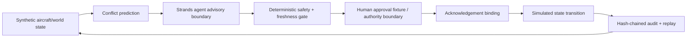

# TowerOps architecture

The agent may propose an advisory, but the deterministic gate decides whether the proposal is admissible. The published demo uses only synthetic state and fixture approvals/acknowledgements.

**Scope:** research simulation only. No live surveillance feed, real clearance issuance, aircraft integration, operational separation assurance, or aviation certification.
