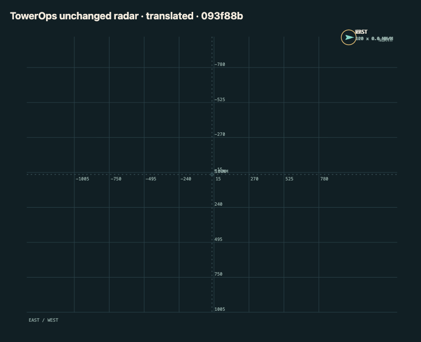
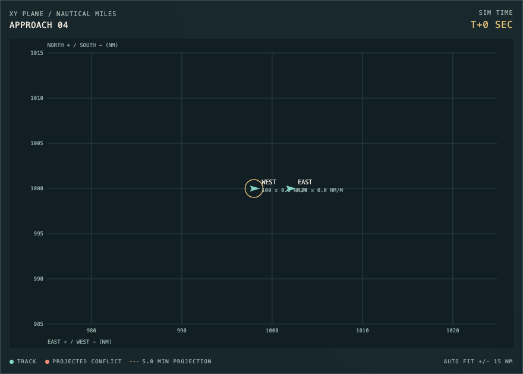
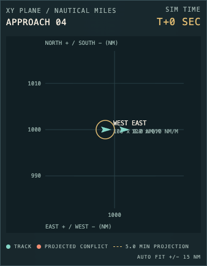
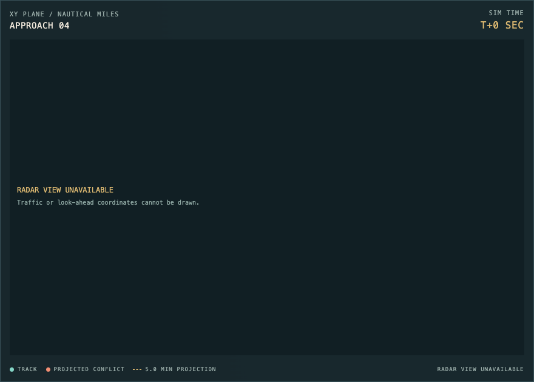

# TowerOps radar framing — native receiving

This packet qualifies the five-file radar framing contribution against TowerOps main **093f88b29d6e1ede778f967528c7e010b7689ab1** (tree **4a87643d57cabf81e570b21c119f00b43f79448e**). It is author qualification of the frozen candidate, before integration and public deployment. The source claim is [[redacted]]([redacted]).

## User-visible change

A valid imported traffic cluster far from (0,0) previously collapsed into almost one marker because range was measured from the world origin. The renderer now fits current positions and existing look-ahead endpoints, with one scale for both axes. A common translation preserves relative screen geometry. Grid ticks retain absolute east/north coordinates, with north increasing upward. Axes and distance reference rings remain at the actual world origin.

The minimum half-range is 15 NM, with at least 2 NM of padding, 10% for wider traffic, and rounding up in 5 NM steps. The renderer handles empty, single and coincident input without a zero scale. Empty import remains rejected by the existing 1–60 aircraft parser contract. Nonfinite input remains rejected. If admitted finite numbers overflow during projection or cannot represent usable view bounds, the radar explicitly displays unavailable and leaves the admitted world unchanged. Automatic fitting remains the view mode; this patch adds no camera controls.

## Source fence

Modified existing files:

- `web/airspace/src/draw.ts`: framing, absolute grid ticks, true-origin guides and unavailable drawing.
- `web/airspace/src/main.ts`: exactly two literal replacements, shown in RESULT.json: the draw import and range readout expression.
- `web/airspace/README.md`: appended framing behavior and limits.

Added files:

- `web/airspace/src/radar-geometry.ts`: pure fitting, aspect ratio, coordinate and bounded tick helpers.
- `web/airspace/tests/radar-geometry.test.ts`: eleven focused test cases.

The conflict marker calculation and aircraft glyph/label drawing function remain byte-identical to the original. Main handlers/state, parser, Python, worker, planner, safety policy, selection, scenario ownership, approvals, audit, HTML and CSS are unchanged. All 48 mirrored source/test files were hashed before and after each successful qualification. The native mirror includes all 46 Airspace runtime/test/source and root Python input files from the pinned source; it excludes only the two existing README capture PNGs.

The current scenario-owner context was inspected read-only: PR #47 head **e8f8fe37e31067c8dbd789577544525afca5e009**, main.ts blob **8b36b59b4eff0fe31ae4f68b7a7c9736acf0f85a**. Both old main.ts literals occur once in canonical main and once in that owner candidate. No scenario source was incorporated or changed.

## Observed results

**Unchanged native baseline:** exact renderer/core/parser source, TypeScript 5.7.3 transpilation, native Chrome Canvas, 800×600 CSS pixels. A 4 NM pair is 74.133 px apart near the origin and 1.106 px apart after a valid (+1000,+1000) NM translation. North-positive positions have negative labels. Input state remains unchanged and there are no page script errors. This is a renderer-level baseline, not a full-app deployment result.

**Candidate source qualification:** TypeScript noEmit exits 0; the full Airspace Vitest suite passes **144/144**, including the 11 new geometry cases. Vite 8.3.3 produces four production bundle outputs in memory with `write:false`; their SHA256 values are retained. Dependencies match the exact existing package lock. Native Python tests use Python 3.13.7.

**Actual full application:** native Mac Chrome 154.0.8037.98 through the existing pinned Vite source server passes **19/19** checks. Real keyboard WorldState entry and pointer actions exercise import, selection, raw draft preservation, export, reset and the CPython planner/approval/readback path. The latter produces exactly one world revision and a valid four-event audit. The server reads the exact installed Pyodide 0.27.7 assets and canonical towerops.py; resource hashes are retained.

At the full-app 847.625×520 CSS-pixel canvas, near and translated 4 NM pairs are both 60.800 px apart. At a 390×844 browser viewport, the 318×320 canvas keeps them 30.133 px apart; document width remains 390 px, and the raw draft and range label remain visible. These canvas sizes differ from the unchanged baseline, so the packet does not present their measurements as a same-size before/after comparison.

Finite projection overflow displays **RADAR VIEW UNAVAILABLE** without invented positions. A subsequent nonfinite import rejects and preserves the last admitted state. All 48 source/test hashes remain unchanged. No page errors or failed requests were observed.

## Retained limits and negative evidence

The initial full-app driver used an unsupported Puppeteer keyboard method and stopped after its first successful check. Its driver and negative receipt are retained unchanged. Driver 2 substitutes the supported keyboard.type method and passes all 19 checks on the same product bytes.

Desktop and 390 px screenshots were visually inspected. Adjacent altitude/speed labels still crowd: the original aircraft-label placement function is deliberately unchanged. This is a retained display limitation, not a claim of new collision avoidance for labels. The 390 px check uses desktop Chrome emulation, not a physical phone, Safari or touch acceptance. There is no human acceptance or public-release claim in this packet.

## Review and reproduction

RESULT.json records exact source changes, observable results, old/new main.ts literals, owner context and receiving boundaries. MANIFEST.json pins every immutable archive member by byte count, SHA256 and Git blob hash. native-receiving.json.gz retains exact source bindings, original/candidate source deltas, unchanged baseline evidence, native compile/test/build evidence, both full-app drivers, original negative receipt and all screenshots. restore-packet.cjs verifies every member before restoring into a new empty destination.

The repo-native regression command is `cd web/airspace && npm test -- radar-geometry.test.ts`. The frozen native drivers retain their exact Mac executable/dependency paths and are receiving evidence; use an owned environment when adapting them. Existing dependencies were read-only, with receiver-owned Vite caches and disposable browser profiles.

The existing [Airspace workflow](https://github.com/Jacob-Met/TowerOps/blob/093f88b29d6e1ede778f967528c7e010b7689ab1/.github/workflows/airspace-demo.yml) runs the normal build/test/browser gates and deploys main pushes through Pages to the existing [Airspace Lab](https://jacobmetoyer.com/TowerOps/airspace/). Integration must preserve the latest main and the current owners; final public acceptance must be tied to the actual merged/deployed SHA.

## Native captures

